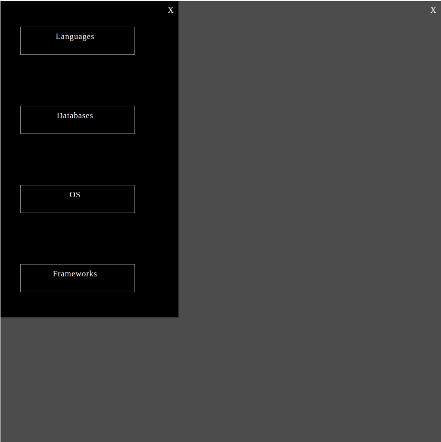

# _Side Bar Menu_

#### _Version 1_
#### _Date 08/30/2020_
#### By _**Adilet Momunaliev**_

## Description

_Responsive side bar menu appears if it's size less then 1000px._

## Getting Started

These instructions will get you a copy of the project up and running on your local machine for development and testing purposes.

### Instruction

* Node js in your local machine
* git clone https://github.com/Adilet312/Side-Bar-Menu.git
* npm install
* npm run start
### Specifications
_Responsive side bar menu appears if it's size less then 1000px._
* ;
* ;
## Technologies Used

_HTML, CSS, JavaScript, DOM Elements and Methods, IDE Atom_

### License

*_Copyright (c) 2020 **Adilet Momunaliev**_*
